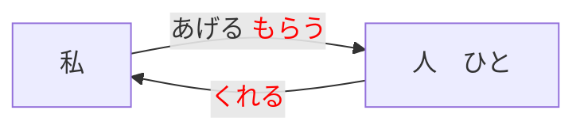
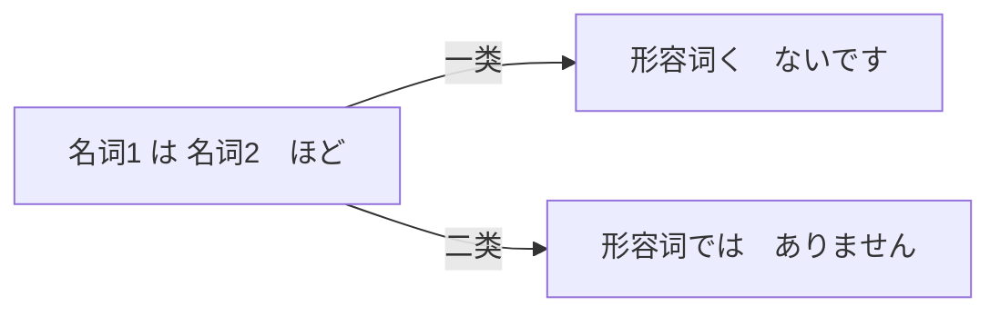

---
grammar_cjkRuby:true
---

# 単語（たんご）

| 日本語（にほんご）     | 日本語（にほんご）   | 词   | ちゅうごくご             |
| ---------------------- | -------------------- | ---- | ------------------------ |
| ちゅうごくじん         |                      | 名   | 中国人                   |
| にほんじん             | 日本人               | 名   | 日本人                   |
| がくせい               | 学生                 | 名   | （大）学生               |
| せんせい               | 先生                 |      | 老师                     |
| りゅうがくせい         | 留学生               |      | 留学生                   |
| きょうじゅ             | 教授                 |      | 教授                     |
| しゃいん               | 社員                 |      | 职员                     |
| かいしゃいん           | 会社員               |      | 公司职员                 |
| てんいん               | 店員                 |      | 店员                     |
| けんしゅうせい         | 研修生               |      | 进修生                   |
| きぎょう               | 企業                 |      | 企业                     |
| だいがく               | 大学                 |      | 大学                     |
| かちょう               | 課長                 |      | 科长                     |
| しゃちょう             | 社長                 |      | 总经理，社长             |
| でむかえ               | 出迎え               |      | 迎接                     |
| あのひと               | あの人               |      | 那个人                   |
| わたし                 |                      |      | 我                       |
| あなた                 |                      |      | 你                       |
| どうも                 |                      |      | 非常                     |
| はい                   |                      |      | 是                       |
| いいえ                 |                      |      | 不是                     |
| こんにちは             |                      |      | 你好                     |
| すみません             |                      |      | 对不起；请问             |
| どうぞ                 |                      |      | 请                       |
| よろしくおねがいします | よろしくお願いします |      | 请多关照                 |
| はじめまして           |                      |      | 初次见面                 |
| ちがいます             |                      |      | 不是                     |
| わかりません           | 分かりません         |      | 不知道                   |
| どうもすみません       |                      |      | 实在对不起               |
|                        |                      |      |                          |
| ほん                   | 本                   |      | 书                       |
| かばん                 | 鞄                   |      | 包，公文包               |
| ノート                 |                      |      | 笔记本，本子             |
| かさ                   | 傘                   |      | 伞                       |
| くつ                   | 靴                   |      | 鞋                       |
| しんぶん               | 新聞                 |      | 报纸                     |
| ざっし                 | 雑誌                 |      | 杂志                     |
| じしょ                 | 辞書                 |      | 词典                     |
| カメラ                 |                      |      | 照相机                   |
| テレビ                 |                      |      | 电视机                   |
| パソコソ               |                      |      | 个人电脑                 |
| ラジオ                 |                      |      | 收音机                   |
| でんわ                 | 電話                 |      | 电话                     |
| つくえ                 | 机                   |      | 桌子，书桌               |
| いす                   |                      |      | 椅子                     |
| かぎ                   |                      |      | 钥匙，锁                 |
| とけい                 | 時計                 |      | 钟，表                   |
| てちょう               | 手帳                 |      | 记事本                   |
| しゃしん               | 写真                 |      | 照片                     |
| くるま                 | 車                   |      | 汽车，车                 |
| じてんしゃ             | 自転車               |      | 自行车                   |
| おみやげ               | お土産               |      | 礼物                     |
| めいさんひん           | 名産品               |      | 特产，名产               |
| シルク                 |                      |      | 丝绸                     |
| ハソカチ               |                      |      | 手绢                     |
| かいしゃ               | 会社                 |      | 公司                     |
| かた                   | 方                   |      | （敬称）位，人           |
| ひと                   | 人                   |      |                          |
| かぞく                 | 家族                 |      |                          |
| はは                   | 母                   |      |                          |
| おかあさん             | お母さん             |      |                          |
| にほんご               | 日本語               |      |                          |
| ちゅうごくご           | 中国語               |      |                          |
| これ                   |                      |      | 这，这个                 |
| それ                   |                      |      | 那，那个                 |
| あれ                   |                      |      | 那，那个                 |
| どれ                   |                      |      | 哪个                     |
| なん                   | 何                   |      | 什么                     |
| だれ                   | 誰                   |      | 谁                       |
| どなた                 |                      |      | 哪位                     |
| この                   |                      |      | 这，这个                 |
| その                   |                      |      | 那，那个                 |
| あの                   |                      |      | 那，那个                 |
| どの                   |                      |      | 哪个                     |
| ありがとうございます   |                      |      | 谢谢                     |
| おいくつ               |                      |      | 多大                     |
|                        |                      |      |                          |
| デパート               |                      |      | 百货商店                 |
| しょくどう             | 食堂                 |      | 食堂                     |
| ゆうびんきょく         | 郵便局               |      | 邮局                     |
| ぎんこう               | 銀行                 |      | 银行                     |
| としょかん             | 図書館               |      | 图书馆                   |
| マソショソ             |                      |      | （高级）公寓             |
| ホテル                 |                      |      | 宾馆                     |
| コソビニ               |                      |      | 便利店                   |
| きっさてん             | 喫茶店               |      | 咖啡馆                   |
| びょういん             | 病院                 |      | 医院                     |
| ほんや                 | 本屋                 |      | 书店                     |
| レストラソ             |                      |      | 餐馆，西餐馆             |
| ビル                   |                      |      | 大楼，大厦               |
| たてもの               | 建物                 |      | 大楼，建筑物             |
| うりば                 | 売り場               |      | 柜台，出售处             |
| トイレ                 |                      |      | 厕所                     |
| いりぐち               | 入り口               |      | 入口                     |
| じむしょ               | 事務所               |      | 事务所，办事处           |
| うけつけ               | 受付                 |      | 接待处                   |
| バーゲソかいじょう     | バーゲソ会場         |      | 降价处理大卖场           |
| エスカレーター         |                      |      | 自动扶梯                 |
| ふく                   | 服                   |      | 衣服                     |
| コート                 |                      |      | 风衣，大衣               |
| デジカメ               |                      |      | 数码相机                 |
| くに                   | 国                   |      | 国，国家                 |
| ちず                   | 地図                 |      | 地图                     |
| となり                 | 隣                   |      | 旁边                     |
| しゅうへん             | 周辺                 |      | 附近，周边               |
| きょう                 | 今日                 |      | 今天                     |
| すいようび             | 水曜日               |      | 星期三                   |
| もくようび             | 木曜日               |      | 星期四                   |
| ここ                   |                      |      | 这里，这个               |
| そこ                   |                      |      | 那里，那个               |
| あそこ                 |                      |      | 那里，那个               |
| こちら                 |                      |      | 这儿，这边               |
| そちら                 |                      |      | 那儿，那边               |
| あちら                 |                      |      | 那儿，那边               |
| どこ                   |                      |      | 哪里，哪儿               |
| どちら                 |                      |      | 哪儿，哪边               |
| あのう                 |                      |      | 请问，对不起             |
| シャンハイ             | 上海                 |      | 上海                     |
| とうきょう             | 東京                 |      | 东京                     |
| いくら                 |                      |      | 多少钱                   |
|                        |                      |      |                          |
| へや                   | 部屋                 |      | 房间，屋子               |
| にわ                   | 庭                   |      | 院子                     |
| いえ                   | 家                   |      | 家                       |
| いま                   | 居間                 |      | 起居室                   |
| れいぞうこ             | 冷蔵庫               |      | 冰箱                     |
| かべ                   | 壁                   |      | 墙壁                     |
| スイッチ               |                      |      | 开关                     |
| ほんだな               | 本棚                 |      | 书架                     |
| ベッド                 |                      |      | 床                       |
| ねこ                   | 猫                   |      | 猫                       |
| いぬ                   | 犬                   |      | 狗                       |
| はこ                   | 箱                   |      | 盒子，箱子               |
| めがね                 | 眼鏡                 |      | 眼睛                     |
| ビデオ                 |                      |      | 录像机                   |
| サッカーボール         |                      |      |                          |
| ビール                 |                      |      |                          |
| ウイスキー             |                      |      |                          |
| こども                 | 子供                 |      |                          |
| きょうだい             | 兄弟                 |      |                          |
| りょうしん             | 両親                 |      |                          |
| いもうと               | 妹                   |      |                          |
| おとこ                 | 男                   |      |                          |
| おんな                 | 女                   |      |                          |
| せいと                 | 生徒                 |      |                          |
| うえ                   | 上                   |      |                          |
| そと                   | 外                   |      |                          |
| なか                   | 中                   |      |                          |
| した                   | 下                   |      |                          |
| まえ                   | 前                   |      |                          |
| うしろ                 | 後ろ                 |      |                          |
| ちかく                 | 近く                 |      |                          |
| ばしょ                 | 場所                 |      |                          |
| きょうしつ             | 教室                 |      |                          |
| かいぎしつ             | 会議室               |      |                          |
| としょしつ             | 図書室               |      |                          |
| こうえん               | 公園                 |      |                          |
| はなや                 | 花屋                 |      |                          |
| ばいてん               | 売店                 |      |                          |
| えき                   | 駅                   |      |                          |
| ちかてつ               | 地下鉄               |      |                          |
| き                     | 木                   |      |                          |
| ひとりぐらし           | 一人暮らし           |      |                          |
| あります               |                      |      |                          |
| います                 |                      |      |                          |
| よこはま               | 横浜                 |      |                          |
| なごや                 | 名古屋               |      |                          |
| おおさか               | 大阪                 |      |                          |
|                        |                      |      |                          |
| いま                   |                      |      |                          |
| せんしゅう             | 先週                 |      |                          |
| らいしゅう             | 来週                 |      |                          |
| さらいしゅう           | 再来週               |      |                          |
| こんしゅう             | 今週                 |      |                          |
| きのう                 | 昨日                 |      |                          |
| あした                 | 明日                 |      |                          |
| あさって               | 明後日               |      |                          |
| おととい               |                      |      |                          |
| まいにち               | 毎日                 |      |                          |
| まいあさ               | 毎朝                 |      |                          |
| まいばん               | 毎晩                 |      |                          |
| まいしゅう             | 毎週                 |      |                          |
| ごぜん                 | 午前                 |      |                          |
| ごご                   | 午後                 |      |                          |
| にちようび             | 日曜日               |      |                          |
| げつようび             | 月曜日               |      |                          |
| かようび               | 火曜日               |      |                          |
| きんようび             | 金曜日               |      |                          |
| どようび               | 土曜日               |      |                          |
| こんばん               | 今晩                 |      |                          |
| らいねん               | 来年                 |      |                          |
| きょねん               | 去年                 |      |                          |
| よる                   | 夜                   |      |                          |
| ばん                   | 晩                   |      |                          |
| あさ                   | 朝                   |      |                          |
| がっこう               | 学校                 |      |                          |
| しけん                 | 試験                 |      |                          |
| しごと                 | 仕事                 |      |                          |
| ちこく                 | 遅刻                 |      |                          |
| やすみ                 | 休み                 |      |                          |
| しゅっちょう           | 出張                 |      |                          |
| けんしゅう             | 研修                 |      |                          |
| りょこう               | 旅行                 |      |                          |
| てんらんかい           | 展覧会               |      |                          |
| かんげいかい           | 歓迎会               |      |                          |
| パーテイー             |                      |      |                          |
| おたく                 | お宅                 |      |                          |
| いつ                   |                      |      |                          |
| やすみます             | 休みます             |      |                          |
| はたらきます           | 働きます             |      |                          |
| はじまります           | 始まります           |      |                          |
| おわります             | 終わります           |      |                          |
| おきます               | 起きます             |      |                          |
| ねます                 | 寝ます               |      |                          |
| べんきょうします       | 勉強します           |      |                          |
| いつも                 |                      |      |                          |
| ぺキンししゃ           | 北京支社             |      |                          |
| こうべ                 | 神戸                 |      |                          |
| おはよう               |                      |      |                          |
|                        |                      |      |                          |
| らいげつ               | 来月                 |      | 下个月                   |
| せんげつ               | 先月                 |      | 上个月                   |
| よなか                 | 夜中                 |      | 午夜，半夜               |
| ゆうべ                 | 昨夜                 |      | 昨晚                     |
| コンサート             |                      |      | 音乐会                   |
| クリスマス             |                      |      | 圣诞节                   |
| たんじょうび           | 誕生日               |      | 生日                     |
| こどものひ             | こどもの日           |      | 儿童节                   |
| なつやすみ             | 夏休み               |      | 暑假                     |
| こうつうきかん         | 交通機関             |      | 交通工具                 |
| しんかんせん           | 新幹線               |      | 新干线                   |
| ひこうき               | 飛行機               |      | 飞机                     |
| フェリー               |                      |      | 渡轮                     |
| でんしゃ               | 電車                 |      | 电车                     |
| バス                   |                      |      | 公共汽车                 |
| タクシー               |                      |      | 出租车                   |
| びじゅつかん           | 美術館               |      | 美术馆                   |
| アパート               |                      |      | 公寓                     |
| うち                   |                      |      | 家                       |
| プール                 |                      |      | 游泳池                   |
| ともだち               | 友達                 |      | 朋友                     |
| おとうと               | 弟                   |      | 弟弟                     |
| いきます               | 行きます             |      | 去                       |
| かえります             | 帰ります             |      | 回来，回去               |
| きます                 | 来ます               |      | 来                       |
| たしか                 |                      |      | 好像是，大概；的确       |
| まっすぐ               |                      |      | 径直，笔直               |
| いっしょに             |                      |      | 一起                     |
| ペキン                 | 北京                 |      | 北京                     |
| ひろしま               | 広島                 |      | 广岛                     |
| きょうと               | 京都                 |      |                          |
| ほっかいどう           | 北海道               |      |                          |
| はこね                 | 箱根                 |      |                          |
| ぎんざ                 | 銀座                 |      |                          |
| しぶや                 | 渋谷                 |      |                          |
| しんじゅく             | 新宿                 |      |                          |
| おつかれさまでした     | お疲れ様でした       |      | 够累的                   |
| おさきにしつれいします | お先に失礼します     |      | 我先走了，告辞了         |
| あるいて               | 歩いて               |      | 步行                     |
| たいへんですね         | 大変ですね           |      | 真不容易，够受的，不得了 |
|                        |                      |      |                          |
| コーヒー               |                      |      |                          |
| コーラ                 |                      |      | 可乐                     |
| おちゃ                 | お茶                 |      |                          |
| ワイン                 |                      |      |                          |
| パン                   |                      |      |                          |
| ケーキ                 |                      |      |                          |
| おかゆ                 | お粥                 |      |                          |
| ひるごはん             | 昼ご飯               |      |                          |
| おべんとう             | お弁当               |      |                          |
| そば                   |                      |      |                          |
| うどん                 |                      |      |                          |
| おやこどん             | 親子丼               |      |                          |
| カレー                 |                      |      |                          |
| たまご                 | 卵                   |      |                          |
| チーズ                 |                      |      |                          |
| リンゴ                 |                      |      |                          |
| イチゴ                 |                      |      |                          |
| そばや                 | 蕎麦屋               |      |                          |
| ラニス                 |                      |      |                          |
| ジョギング             |                      |      |                          |
| サッカー               |                      |      |                          |
| やきゅう               | 野球                 |      |                          |
|                        |                      |      |                          |
| けいたい　でんわ       | 携帯電話             |      | 手机                     |
| つくえ                 | 机                   |      | 桌子                     |
| いす                   | 椅子                 |      | 椅子                     |
| かぎ                   | 鍵                   |      | 钥匙                     |
|                        |                      |      |                          |
|                        |                      |      |                          |

# 第一课

日语是  主宾谓结构  主语+对象+干什么

~人　（じん）

～语    （ご）

教师，医生，律师都叫せんせい

### は

日语：黏着语（靠助词连接各部分）

**必须是~ は +~です  才是是的意思**

は：凸显助词 (提示其前面部分的**主题**)　前后不能加动词，只能加名，代　　[~是~] 

 が：提示主语 

[^飯]: はん
[^食]: しょ

私は　ご飯を　食べました

我吃了饭

[^今日]: きょ
[^天気]: てんき

今日は天気がいいです。

今天天气很好

私（わたし）		あなた		あの人

# 第二课

### 否定（ひてい）

です否定是ではありません

口语中一般为じゃ(ja)ありません

### 応答（おうとう）

はい、そうです。

是，是的

いいえ、ちがいます

不，不是的

わかりません

不知道

### 称呼（しょうこ）

|                          | 称呼别人的家庭成员 | 对外称呼自己的家庭成员 | 家庭成员内部称呼 |
| ------------------------ | ------------------ | ---------------------- | ---------------- |
| 祖父/外祖父              | おじいさん         | そふ                   | おじいさん       |
| 祖母/外祖母              | おばあさん         | そぼ                   | おばあさん       |
| 父亲                     | お父（とう）さん   | ちち                   | お父（とう）さん |
| 母亲                     | お母（かあ）さん   | はは                   | お母（かあ）さん |
| 叔叔/舅舅/伯伯/姑父      | おじさん           | おじ                   | おじさん         |
| 婶婶/舅妈/伯母/姑姑/阿姨 | おばさん           | おば                   | おばさん         |
| 哥哥                     | お兄（にい）さん   | あに                   | お兄（にい）さん |
| 姐姐                     | お姉（ねえ）さん   | あね                   | お姉（ねえ）さん |
| 弟弟                     | 弟（おとうと）さん | おとうと               | 名前             |
| 妹妹                     | 妹（いもうと）さん | いもうと               | 名前             |

### これ／それ／あれ

离自己近、离你近、离我们都远

どれ（多个选择）

どちら（两个中选择）

これ は　

### この／その／あの／どの

连体词后要加名词

谁（だれ）

不知道是什么人时用

用于地位相当

谁（どなた）

用于尊长或比自己地位高

何（なん）

不知道是什么事物时用

この　（その）「あの」　本は誰の本ですか

その　（この）「あの」　本は***さんの本です

特殊疑问句：含有疑问词的句子 你是谁？

一般疑问句：不含有疑问词的句子

# 第三课

### ここ／そこ／あそこ

这里/那里/那里

敬语：こちら／そちら／あちら／どちら

...　＋　は　+...　です.

ここ

距说话人、听话人都进

そこ

距听话人进

あそこ

距两人都远

どこ

哪里

### 数字

|      |                |      |                            |
| :--- | -------------- | ---- | -------------------------- |
| 1    | いち           | 11   | じゅういち                 |
| 2    | に             | 12   | じゅうに                   |
| 3    | さん           | 13   | じゅうさん                 |
| 4    | し　／　よん   | 14   | じゅうし　／　じゅうよん   |
| 5    | ご             | 15   | じゅうご                   |
| 6    | ろく           | 16   | じゅうろく                 |
| 7    | しち　／　なな | 17   | じゅうしち　／　じゅうなな |
| 8    | はち           | 18   | じゅうはち                 |
| 9    | く　／　きゅう | 19   | じゅうく　／　じゅうきゅう |
| 10   | じゅう         | 20   | にじゅう                   |
| 0    | れい　／　ぜろ |      |                            |

### 楼层

| 平假名                            | 日语   | 汉语 |
| --------------------------------- | ------ | ---- |
| いっかい   | 一階   |      |
| にかい                            | 二階   |      |
| さんがい   | 三階   |      |
| よんかい                          | 四階   |      |
| ごかい                            | 五階   |      |
| ろっかい   | 六階   |      |
| ななかい                          | 七階   |      |
| はちかい　／はっかい              | 八階   |      |
| きゅうかい                        | 九階   |      |
| じゅっかい | 十階   |      |
| にじゅっかい                      | 二十階 |      |
| なんかい                          | 何階   | 几楼 |

### も

も：相当于汉语的”也“

一个月 两点火 三点水 四画木 五金 六是土 日是周日

### いくら（多少钱）

これ　は　いくらですか

# 第四课

がくせい（学生）指其它学生（除初高学生）

せいと（生徒）  专指初/高学生

墙上在日语比如壁の上是天花板，所有要用壁に

うしろ／後（あと）

1.表示时间顺序，在...之后。

2.剩下~~~

- あと5分です

- あと100均です

  

あります　　います

表示事物的存在。--->都是 有

有生命特征的

无生命特征的

あります 用于不动的事物或生物

います 用于动的事物或生物

### ~在~

名【物/人】は 名【场所】に あります／います

某物在某地

  这个句型表示【（物/人）在（某处）】

- 【は 】提示存在的东西
- 【に】是格助词，表示事物存在的场所
- 【あります】表示不动的事物或者生物
- 【います】表示的是会动的事物或生物

は　提示主题=>存在的事物

に　提示地点：在~

##### あります います

A 　は　B に　あります （不动）

A 　は　B に　います （会动）	

A在B处

其否定形式是【...は....にありません／いません】

A 　は　B に　ありません（不动）

A 　は　B に　いません（会动）

A不在B处

疑问句时用【...は....に ありますか／いますか】

-------------------------------------------

名【场所】に　名【物/人】が　あります／います

某地有某物

  这个句型表示【（某处）有（物/人）】

- 【に】仍然表示事物存在的地点
- 【が】是格助词，表示存在的主体
- 【あります／います】表示有

如要对存在的主体进行提问，用疑问词【なに（何）】

否定形式是【...に...がありません／いません】

### は（注意）

有时候在格助词【に】后面接续【は】来起到提示主题的作用，除了加强补语的语气以外，还含有进行比较、区别于其他场所的意思。

例子：

* 床上有一只猫

  > ベツトの上には猫（ねこ）がいます

* 课长在会议室里

  > 課長（かちょう）は会議室（かいぎしつ）にはいます

### と

名 と 名 【并列】  と=和

 

李ちんと　私　（と）の関係（かんけい）

小李和我和我的关系

上（うえ）　／　下（した）　／　前（まえ）　／　後ろ（うしろ）　／　隣（となり）　/　近く（ちかく）　／　中（なか）　／　外（そと）

### も

疑问词 + も + 表示否定的动词

全面否定，表示”什么都没.....“；”一个人也没.......“

# 第五课

### 天

| 前天     | 昨天   | 今天   | 明天   | 后天     |
| -------- | ------ | ------ | ------ | -------- |
| おととい | きのう | きょう | あした | あさって |
| 一昨日   | 昨日   | 今日   | 明日   | 明後日   |

### 周

| 上周       | 这周       | 下周       | 下下周       |
| ---------- | ---------- | ---------- | ------------ |
| せんしゅう | こんしゅう | らいしゅう | さらいしゅう |
| 先週       | 今週       | 来週       | 再来週       |

### お宅（たく）

“府上、（您）家”的意思；也可以是啊宅【オタク】（宅男的意思）

### 动词的变形

* 一类动词  ==  五段活用动词
* 二类动词  ==  一段活用动词
* 三类动词  ==  カ变、サ变动词

动词的原型  ==  辞书行

##### 三类动词

来る　／　する

> 动名词 + する

結婚（けっこん）　=>  虽然是名词词性但是有动词的含义 => 动名词

##### 二类动词

以る结尾的动词，并且る前面的假名为い段或者是え段

例

| 日语   | 平假名   | 段   |
| ------ | -------- | ---- |
| 起きる | おきる   | い   |
| 寝る   | ねる     | え   |
| 教える | おしえる | え   |

##### 一类动词

一类动词中以る结尾的动词，前面的假名为あ、う、お段

没有る的情况下，该词肯定是一类动词

特殊： 入る、走る（はしる）、知る（しる）、切る（きる）、帰る（かえる）、返る（かえる）、いる

### 变ます形

一般用于敬语

食（しょく）べる　＝＞　食べます

##### 一类动词

把最后一个う段变成い段

如：走る　＝＞　走ります

##### 二类动词

把る去掉+ます  

##### 三类动词

する 变成 し+ます

来る => 来（き）ます 

------------

##### 变否定

Vます => Vません

##### 时间

表示现在的时间时

双方都明确在讲时间时，“今”可以省略。

询问具体时间时用【何時（なんじ）】。

另外，询问星期几用【何曜日（なんようび）】

今日（きょう）

##### 过去式变形

现在、将来肯定形式：Vます

现在、将来否定形式：Vません

过去肯定形式：Vました

过去否定形式：Vませんでした

如果疑问就在后面直接加か

### に

表示具体的时间时用【に】

1. 对象=>

2. 具体时间
3. 点(ここに～があります)

例子

​	私は　夜（よる）10時　に　寝（ね）ます

### から　まで

格助词【から】【まで】表示起点和终点  “从....到....”

【~から ~まで】表示某动作发烧在某个期间（时间范围）时用

例

> 李さんは　水曜日（すいようび）から　木曜日（もくようび）休みました

也可以用于空间

【~から ~まで】表示某动作发生、作用所及范围时用

例

> 食堂（しょくどう）から図書館まで

​	

### 疑问词いつ

询问某动作或事态进行的时间的时候使用，若询问具体的时间，则用【何時に、何曜日に】

例（れい）：

> 試験　は　いつですか
>
> 什么时候考试

> いつ　アメリカへ　行（い）きますか
>
> 什么时候去美国

# 第六课

### 月

月（つき）（がつ）（げつ）

### へ

名称【场所】へ

「へ」是格助词，读「え」

​		接在体言后面表示移动的方向，具有离开 原位向另一地方移动的动态语感。表示移动的动词有：「行（こう）きます」「帰（かえ）ります」

1. 移动的方向（大地点）

> 日本へ行きます

2. 动作方向的对象（集团、组织）

> 会社へ<ruby>資料<rt>しりょう</rt></ruby>を<ruby>送り<rt>おくり</rt></ruby>ました

### から

名「場所（ばしょ）」

​	使用移动动词是，移动的起点用【から】表示

1. 时间，空间的起点

> <ruby>課長<rt>かちょう</rt></ruby>は来週の火曜日から<ruby>出張<rt>しゅっちょう</rt></ruby>します

2. 动作方向的对象（集团、组织）从~

> <ruby>会社<rt>かいしゃ</rt></ruby>からメールをもらいました

### で

名【交通工具】＋　で

1通过~；使用~；（用）

本质：动作所需的方式；手段

> 交通手段用助词【】表示。不使用交通工具而步行时用【歩（ある）いて】走路；【走（はし）る】跑

例：

> 私はバス　で　家（いえ）へ帰（かえ）ります。

### 日期几号

|          |      |        |      |
| -------- | ---- | ------ | ---- |
| ついたち | 一日 | ふつか | 二日 |
| みっか   | 三日 | よっか | 四日 |
| いつか   | 五日 | むいか | 六日 |
| なのか   | 七日 | ようか | 八日 |
| ここのか | 九日 | とおか | 十日 |
|          |      |        |      |
|          |      |        |      |

# 第七课

### を

名 + を + 动

を是格助词，表示宾语。宾语是表示动作所涉及的对象和内容的句子成分。

> 动作的对象用助词“を”，读作“お”

これから、（わたしは）日本語をします

「副词」译为：从今以后、接下来

> 从今以后我要学日语

### で

后面如果是动词或者动名词前面都用で，不用に

> ここ　で　試験（しけん）があります

动作发生的场所；在某地做某事

### か

名+か+名

“或者”

并列助词词“か”表示选择

例：

   休（やす）みは何曜日ですか

   休みは月曜日（げつようび）か　火曜日（かようび）です

### を　ください

[てください](#てください)

[ないでください](#ないでください)

名 + を ください

表示**请给我**的意思。是敬语的表达方式.

# 第八课

### 借りる（向别人借，借入）

> 貸す（借出）

新聞（しんぶん）==> 报纸

二ュース　==> 新闻

### かける

- 電話　を　かける

- > 打电话

- 電話　する

- > 打电话

- 電話　に　でる

- > 接电话

- 電話　を　切（き）る

- > 挂电话

### おし

教える

教えます教；告诉

|      |                  |                                    |
| ---- | ---------------- | ---------------------------------- |
| 已经 | もう             | 先生は　もう　来ました             |
| 刚才 | さっき           | さっき電話をかけました             |
| 刚刚 | たった今（いま） | たった今コーヒーを飲（の）みすした |

よかったです

> 太好了

### で

名词【工具】动=动作所需的方式和手段及原材料

还可表示其它手段

例：

> カメラで　写真（しゃしん）を撮（と）る
>
> 用相机拍照

动作发生的场所（在）

食堂（しょくどう）でご飯（めし）を食（しょく）べます

### 授受关系

> あげる
>
> 给(以我为主语或者跟我关系近家属)（都是亲人）

> もらう
>
> 得到（以我为主语或者跟我关系近家属）

> くれる
>
> 给（以别为主语）

名词1【人】　は　 名词2【人】 　に　 名词3【物】　を　 あげます

> 名词1把名词3给名词2

わたしは　<ruby>小野<rt>おの</rt></ruby>さん <u>に</u>　<ruby>辞書<rt>じしょ</rt></ruby>を　もらいました。

> に　==>　から

# 复习

### います　と　あります

（场所） **に** （人*物）  **が**　　います／あります　　某地有某物

（人*物） **は** （场所）　**に**　　います／あります　　某物在某地

### 【は=>が】

疑问词做主语时【は=>が】

<ruby>誰<rt>だれ</rt></ruby>が<ruby>部屋<rt>へや</rt></ruby>にいますか　＝　部屋に誰がいますか

### も

- 疑问词+も+动词（否定） 全面否定

例

> 部屋に　誰　も　いません

> <ruby>庭<rt>にわ</rt></ruby>に　何　も　ありません

そちらこそ

> 你才是

こちらこそ　すみませんでした

> 我才是（彼此彼此）

### 会（かい）います

例

部長（ぶちょう）と　会います

> 约定过的情况

李さん　に　会います

> 偶然；单方面遇见

# 第九课

### 大変（たいへん）

十分，非常（副词）。不容易（名词）

### たくさん

たくさん（沢山）

> 多种多样

即是名词又是副词

例

- たくさんの人（ひと）がいます
- ひとが　たくさん　います

### 形容词

##### い形容词（一类形容词）　

以“い”结尾的形容词

新（あたら）しい <-----> 古（ふる）い

##### な形容词（二类形容词）

不是以“い”结尾的形容词

特殊

**綺麗   嫌い** 

### 形容词用法

* 修饰语（定语）
  * 今天是个美好的天气
  * 今日はいい天気（てんき）ですわ
* 修饰语（定语）词干+词尾
* 一类形容词

~い+名词

> 词尾是“い”

<ruby>高<rt>たか</rt></ruby>い+<ruby>山<rt>やま</rt></ruby>　＝＞　高い山

* 二类形容词

> 词尾是“だ”

~な+名词

きれいだ+<ruby>花<rt>はな</rt></ruby>　＝＞　きれいだ花

--------------

* 述语（谓语）
  * 你真漂亮
  * あなたは本当（ほんとう）にきれいですわ

### 述语（谓语）变形

##### 二类形容词

「行動」うご

だ　＝　です

> 简体 = 敬体

| 非过去                             | 非过去             | 过去       | 过去                     |
| ---------------------------------- | ------------------ | ---------- | ------------------------ |
| **肯定**                           | **否定**           | **肯定**   | **否定**                 |
| です                               | ではありません     | でした     | ではありませんでした     |
| <ruby>暇<rt>ひま</rt></ruby>です   | 暇ではありません   | 暇でした   | 暇ではありませんでした   |
| <ruby>嫌<rt>いや</rt></ruby>いです | 嫌いではありません | 嫌いでした | 嫌いではありませんでした |
| <ruby>静<rt>しず</rt></ruby>かです | 静かではありません | 静かでした | 静かではありませんでした |
|                                    |                    |            |                          |

##### 一类形容词

**「行」**こう

否定：い　＝　く　+　ない

过去：い　＝　かっ　+　た

<table><tbody>
<tr>
	<td bgcolor=#FFFFFF colspan="2">
    	<b>非过去</b>
    </td>
    <td bgcolor=#FFFFFF colspan="2">
    	<b>过去</b>
    </td>
</tr>
<tr>
    <td bgcolor=#00FF66>肯定</td>
    <td bgcolor=#FF0066>否定</td>
    <td bgcolor=#00FF66>肯定</td>
    <td bgcolor=#FF0066>否定</td>
</tr>
<tr>
    <td>~い</td>
    <td>～く　ない</td>
    <td>～かった</td>
    <td>～くなかった</td>
</tr>
<tr>
    <td>
        <ruby>暑<rt>あつ</rt></ruby>
        い
    </td>
    <td>
        <ruby>暑<rt>あつ</rt></ruby>
        くない
    </td>
    <td>
        <ruby>暑<rt>あつ</rt></ruby>
        かった
    </td>
    <td>
        <ruby>暑<rt>あつ</rt></ruby>
        くなかった
    </td>
</tr>
<tr>
    <td>
        <ruby>広<rt>ひろ</rt></ruby>
        い
    </td>
    <td>
        <ruby>広<rt>ひろ</rt></ruby>
        くない
    </td>
    <td>
        <ruby>広<rt>ひろ</rt></ruby>
        かった
    </td>
    <td>
        <ruby>広<rt>ひろ</rt></ruby>
        くなかった
    </td>
</tr>
<tr>
    <td>
        <ruby>楽<rt>たの</rt></ruby>し
        い
    </td>
    <td>
        <ruby>楽<rt>たの</rt></ruby>し
        くない
    </td>
    <td>
        <ruby>楽<rt>たの</rt></ruby>し
        かった
    </td>
    <td>
        <ruby>楽<rt>たの</rt></ruby>し
        くなかった
    </td>
</tr>
<tr>
    <td>
        <ruby>忙<rt>いそが</rt></ruby>し
        い
    </td>
    <td>
        <ruby>忙<rt>いそが</rt></ruby>し
        くない
    </td>
    <td>
        <ruby>忙<rt>いそが</rt></ruby>し
        かった
    </td>
    <td>
        <ruby>忙<rt>いそが</rt></ruby>し
        くなかった
    </td>
</tr>
<tr>
    <td bgcolor=#FF9999>いい</td>
    <td bgcolor=#FF9999>よくない</td>
    <td bgcolor=#FF9999>よかった</td>
    <td bgcolor=#FF9999>
        よくなかった
    </td>
</tr>
</table>

### 程度副词

> とても
>
> 非常

> すにし
>
> 稍微

> ちょっと
>
> 一丁点

> あまり
>
> ぜんぜん
>
> 几乎没有；完全没有

### ～が

1.如形容词是：好きｌ（すき），嫌い（きらい），怖い（こわい）；

则名词后用”が”

##### 上手（じょうず）  ----  下手（へた）

(一般不形容自己)

> 擅长 -----  不擅长

##### 苦手 -----  得意

>  不擅长 ----- 擅长

（可以说自己）

例

> 私は<ruby>英語<rt>えいご</rt></ruby>が<ruby>苦手<rt>にがて</rt></ruby>です。

2.できます、わかります　＜＝　能力/自动词

例

> 李さんは日本語がわかりますか。

> 李さんは<ruby>料理<rt>りょうり</rt></ruby>ができますか。

3.

### 名  や　名

> 和（不完全列举）
>
> 中国人 や 日本人　など

并列助词と连接名词，表示“和”“跟”。并且 と用于列举所有项目。助词や也用于连接名词，但や一般用于列举多项中的两项，中文译为~呀... 什么的。且**や**常与**など**联用，构成**~や　～など　が**。当然，有时也可以省略**など**，书写时用、代替**や**。

### から　和　だから（原因理由）

助词**から**用于说明原因，理由。并且谓语陈述原因，理由的句子句尾。日语中既可以先说明原因，理由之后再陈述结论，也可以先陈述结论再说明原因，理由。但无论哪种情况，**から**都必须接在表示原因，理由的小句句尾。小局即构成复句的句子。

例

> 暑いですから，エァコンをつけます。
>
> エァコンをつけます，暑いですから

# 第十一课

時々（有时；或者）

# 第十二课

### 名词1 は  名词2 より 形容词 です

> 中国　は　日本　より　ずっと　広いです
>
> 中国比日本辽阔得多。

### 名词1 より 名词2 の　<ruby>方<rt>ほう</rt></ruby>が 形容词　です

> 火曜日 より 月曜日 のほうが 暇です

### 否定

### 名1　の　<ruby>中<rt>なか</rt></ruby>で  名2　がいちばん　形容词　です

在名词1之中名词2最......

<table>
    <tr><td bgcolor=#D1EEEE>在某个范围内，表示【名词2】最具有该句形容词的性质时使用这个句型。</td></tr>
	<tr><td bgcolor=#D1EEEE>【名词1】是表示【名词2】所属范围的名词</td></tr>
</table>
例

スポーツ **の中で**  サッカーが　いさばん

> 在各种体育活动中，足球最有意思

##### で

表示范围；在..之中；

### 名1 と 名2 と　どちらが　 形容词　ですか

どちら　<==>　どれ （可互换二选一和多选一）

名词1 和 名词2 哪个（更）.....（二选一）

<table>
    <tr><td bgcolor=#D1EEEE>询问两种
        事物中哪一个更具有该局形容词的性质时使用这个句型。</td></tr>
	<tr><td bgcolor=#D1EEEE>【どちら】是二者选一是使用的
        疑问句。
        回答时使用【～のほうが...】。如果二者程度相当，则使用【どちらも～です】</td></tr>
</table>

<table>
    <tr><td bgcolor=#D1EEEE>【どちら】在口语中有时会说成【どっち】</td>
    </tr>

例

> 日本語　と　<ruby>英語<rt>えいご</rt></ruby>　と　どちらが　<ruby>難<rt>むずか</rt></ruby>しいですか
>
> 日语和英语，哪一个难学？
>
> --　日本語のほうが　難しいです
>
> --　日语更难

> コーヒー　と　<ruby>紅茶<rt>こうちゃ</rt></ruby>　と　どっちが　好きですか
>
> 咖啡和红茶，更喜欢哪个？
>
> --　どっちも　すきです
>
> --　都喜欢

##### どの名词　いつ、どれ、だれ、何　が　いちばん　形容词　ですか

询问三种以上

例

> この<ruby>中<rt>なか</rt></ruby>で　どの料理が　いちばん　おいしいですか
>
> 这些菜当中，哪个菜最好吃
>
> この料理がいちばんおいしいです
>
> 这个菜最好吃

> <ruby>季節<rt>きせつ</rt></ruby>の中で　いつが　いちばん　すきですか
>
> 四季之中，你最喜欢哪个季节

### 接续助词【が】的用法

虽然...但是...

<table>
    <tr><td bgcolor=#D1EEEE>接续助词【が】接在句末
        ，用于连接两个相反的，不协调的事项；也可连接没有转折意义的前后两个句子，此外【が】没有任何意义，仅仅起连接作用，前句大多是交代后句所需的前提、情况等。</td></tr>
</table>

例

> このリンゴは　<ruby>安<rt>やす</rt></ruby>いです　が　あまり　おいしくあります
>
> 这个苹果虽然便宜，但是却很好吃

# 第十三课

### くらい/ぐらい【辅助词】大概，大约

形容词+名词

### 副词修饰动词和形容词

### とりあえず【辅词】暂且；火速

### だいたい　

①【名词】概要  

②【副词】大体上，本来，总之自动词与他动词

自动词：不需要借助宾语（可主谓结构）

他动词：一定要借助宾语的

### 架かる（かかる）【自动词】

### 掛ける（かける）【他动词】悬挂，花费

> <ruby>壁<rt>かべ</rt></ruby>に　を　掛けます
>
> 把画挂在墙上

> 母に<ruby>電話<rt>でんわ</rt></ruby>を掛けます
>
> 给妈妈打电话

> <ruby>服<rt>ふく</rt></ruby>にお<ruby>金<rt>かな</rt></ruby>を掛けます
>
> 在买衣服上花钱

### 数量词

数量词在日语的词性与名词及代词同类，被称作体言，因此在日语中大部分与名词相同，如做主语，谓语，定语，但**不能做宾语**。

数量词+の+名词

> 二個のパン　を　<ruby>食<rt>しょく</rt></ruby>べました

直接接在动词前面

> パン　を　二個食べました

### 时间+“<ruby>間<rt>かん</rt></ruby>”

例

小时（时+間）、周（+間）

日、年、分可不加，除此之外，ヶ是“ヶ月”

### 名词（时间）+动词

表示时间的数量词与动词一起使用时，表示的是动作或者状态的持续时间，后面不加に。表示的是动作发生的时间。

> 李さんは<ruby>毎日<rt>まいにち</rt></ruby>七時間<ruby>働き<rt>はたらき</rt></ruby>ます
>
> 小李每天工作7小时

> 李さんは七時に<ruby>起き<rt>おき</rt></ruby>ます
>
> 小李7点起床

### 名词（时间）に 名词（次数）+动词

表示在一定时间内进行某动作的频率

> 森さんは<ruby>一週間<rt>いっしゅうかん</rt></ruby>に二<ruby>回<rt>かい</rt></ruby>プールへ行きます

> この<ruby>花<rt>はな</rt></ruby>は二<ruby>年<rt>ねん</rt></ruby>に一<ruby>度<rt>ど</rt></ruby><ruby>咲<rt>さき</rt></ruby>きます
>
> 这花两年一绽放

# 第十四课

### を

1. 提示宾语
2. 通过，经过，穿过的地点

例

> ご<ruby>飯<rt>はん</rt></ruby>が<ruby>喉<rt>のど</rt></ruby>を<ruby>通らない<rt>とおらない</rt></ruby>です

### て变形

<table>
<tbody>
<tr>
	<td bgcolor=#FFFFFF>
    	<b>类别</b>
    </td>
    <td bgcolor=#FFFFFF>
    	<b>辞书行</b>
    </td>
    <td bgcolor=#FFFFFF>
    	<b>ます形</b>
    </td>
    <td bgcolor=#FFFFFF>
    	<b>て形</b>
    </td>
</tr>
<tr>
    <td  rowspan="10">Ⅰ</td>
    <td bgcolor=#C9F6C1>
        <ruby>書く<rt>かく</rt></ruby>
    </td>
    <td bgcolor=#C9F6C1>
        <ruby>書き<rt>かき</rt>ます</ruby>
    </td>
    <td bgcolor=#C9F6C1>
        <ruby>書い<rt>かい</rt>て</ruby>
    </td>
</tr>
<tr bgcolor=#C9F6C1>
    <td>
        <ruby>泳ぐ<rt>およぐ</rt></ruby>
    </td>
    <td>
        <ruby>泳ぎ</ruby>ます
    </td>
    <td>
        <ruby>泳い</ruby>で
    </td>
</tr>
<tr>
    <td bgcolor=#D9F2FA>
        <ruby>洗う<rt>あらう</rt></ruby>
    </td>
    <td bgcolor=#D9F2FA>
        <ruby>洗い</ruby>ます
    </td>
    <td bgcolor=#D9F2FA>
        <ruby>洗っ</ruby>て
    </td>
</tr>
<tr bgcolor=#D9F2FA>
    <td>
        <ruby>待つ<rt>まつ</rt></ruby>
    </td>
    <td>
        <ruby>待ち</ruby>ます
    </td>
    <td>
        <ruby>待っ</ruby>て
    </td>
</tr>
<tr>
    <td bgcolor=#D9F2FA>
        <ruby>帰る<rt>かえる</rt></ruby>
    </td>
    <td bgcolor=#D9F2FA>
        <ruby>帰り</ruby>ます
    </td>
    <td bgcolor=#D9F2FA>
        <ruby>帰っ</ruby>て
    </td>
</tr>
<tr bgcolor=#E5B6F5>
    <td>
        <ruby>死ぬ<rt>しぬ</rt></ruby>
    </td>
    <td>
        <ruby>死に</ruby>ます
    </td>
    <td>
        <ruby>死ん</ruby>で
    </td>
</tr>
<tr>
    <td bgcolor=#E5B6F5>
        <ruby>選ぶ<rt>えらぶ</rt></ruby>
    </td>
    <td bgcolor=#E5B6F5>
        <ruby>選び</ruby>ます
    </td>
    <td bgcolor=#E5B6F5>
        <ruby>選ん</ruby>で
    </td>
</tr>
<tr bgcolor=#E5B6F5>
    <td>
        <ruby>読む<rt>よむ</rt></ruby>
    </td>
    <td>
        <ruby>読み</ruby>ます
    </td>
    <td>
        <ruby>読ん</ruby>で
    </td>
</tr>
<tr>
    <td bgcolor=#F2F5B0>
        <ruby>消す<rt>けす</rt></ruby>
    </td>
    <td bgcolor=#F2F5B0>
        <ruby>消し</ruby>ます
    </td>
    <td bgcolor=#F2F5B0>
        <ruby>消し</ruby>て
    </td>
</tr>
<tr>
    <td>
        <ruby>行く<rt>いく</rt></ruby>
    </td>
    <td>
        <ruby>行き</ruby>ます
    </td>
    <td>
        <ruby>行っ</ruby>て
    </td>
</tr>
<tr>
    <td  rowspan="2">Ⅱ</td>
    <td>
        <ruby>見<rt>み</rt>せる</ruby>
    </td>
    <td>
        <ruby>見せます</ruby>
    </td>
    <td>
        <ruby>見せて</ruby>
    </td>
</tr>
<tr>
    <td>
        <ruby>起<rt>お</rt>きる</ruby>
    </td>
    <td>
        <ruby>起きます</ruby>
    </td>
    <td>
        <ruby>起きて</ruby>
    </td>
</tr>
<tr>
    <td  rowspan="3">Ⅲ</td>
    <td>
        <ruby>する</ruby>
    </td>
    <td>
        <ruby>します</ruby>
    </td>
    <td>
        <ruby>して</ruby>
    </td>
</tr>
<tr>
    <td>
        <ruby>買<rt>か</rt></ruby>い<ruby>物<rt>もの</rt></ruby>する
    </td>
    <td>
        <ruby>買い物します</ruby>
    </td>
    <td>
        <ruby>買い物して</ruby>
    </td>
</tr>
<tr>
    <td>
        <ruby>来<rt>く</rt>る</ruby>
    </td>
    <td>
        <ruby>来<rt>き</rt>ます</ruby>
    </td>
    <td>
        <ruby>来<rt>き</rt>て</ruby>
    </td>
</tr>
</tbody>
</table>

### て

1.链接了两个以上的动作

2.强调了动作的先后顺序

例

> <ruby>今日<rt>きょう</rt></ruby>の<ruby>午後<rt>ごご</rt></ruby><ruby>友達<rt>ともだち</rt></ruby>と<ruby>会<rt>あ</rt></ruby>って、レストランで<ruby>食事<rt>しょくじ</rt></ruby>します

### ~て　+　から

意味：

两个动作的停顿，强调动作的前后紧密联系。

1. 前项动作进行后，马上就发生后项动作“~了，就...”
2. 后项动作发生之前，前项动作是必要的“~了，再...”
3. “自从~”

注意：时态在最后尾句的动作是体现

例

> うちへ<ruby>帰<rt>かえ</rt></ruby>ってから、電話をします

> <ruby>手<rt>て</rt></ruby>を<ruby>洗<rt>あら</rt></ruby>ってから、ご<ruby>飯<rt>はん</rt></ruby>を食べます

> 日本へ来てから、日本語の<ruby>勉強<rt>べんきょう</rt></ruby>をはじめました

### ～て　+　ください

[をください](#をください)

[ないでください](#ないでください)

动词+て　ください

意味：

要求，命令。

一般上级对下级；

对于下级的人或者平级中亲密的人，可省略【～て　ください】，只说【～て】

对于上级的人，不能直接使用，可以用更礼貌的【～てくださいませんか】

<table>
<tr>
	<td bgcolor=#FFFFFF>
    	<b>
            を　动作移动的场所、				范围
        </b>
    </td>
    <td bgcolor=#FFFFFF>
    	<b>
            で　动作发生的场所			
        </b>
    </td>
</tr>
<tr>
    <td>
        
            <ruby>公園<rt>こうえん</rt></ruby>を　
            <ruby>散歩<rt>さんぽ</rt></ruby>します
        
    </td>
    <td>
        
            <ruby>公園<rt>こうえん</rt></ruby>で　
            <ruby>遊び<rt>あそび</rt></ruby>ます
        
    </td>
</tr>
<tr>
    <td>
        
            <ruby>空<rt>そら</rt></ruby>を　
            <ruby>飛び<rt>とび</rt></ruby>ます
        
    </td>
    <td>
        
            レストランで　
            <ruby>食事<rt>しょくじ</rt></ruby>します
        
    </td>
</tr>
<tr>
    <td>
        
            <ruby>廊下<rt>ろうか</rt></ruby>を　
            <ruby>走り<rt>はしり</rt></ruby>ます
        
    </td>
    <td>
        
            <ruby>廊下<rt>ろうか</rt></ruby>で　
            <ruby>話<rt>はなし</rt></ruby>します
        
    </td>
</tr>
<tr>
    <td>
        
            フールを　
            <ruby>泳ぎ<rt>およぎ</rt></ruby>ます
        
    </td>
    <td>
        
            フールで　
            <ruby>泳ぎ<rt>およぎ</rt></ruby>ます
        
    </td>
</tr>
</table>

<table>
    <tr><td bgcolor=#F6A195>体育活动锁进行的场所要使用【で】</td></tr>
    <tr><td bgcolor=#F6A195>公園で　
        <ruby>野球<rt>やきゅう</rt></ruby>を　します</td></tr>
</table>
### に

に　动作的归着点

<table>
<tr>
	<td bgcolor=#FFFFFF>
    	<b>
            他动词　动作内容最后的落点
        </b>
    </td>
    <td bgcolor=#FFFFFF>
    	<b>
            自动词　动作主动穿越几个空间后的落点			
        </b>
    </td>
</tr>
<tr>
    <td>
        
            <ruby>財布<rt>さいふ</rt></ruby>を　
            <ruby>電車<rt>でんしゃ</rt></ruby>に
            <ruby>忘れ<rt>わすれ</rt></ruby>ました
        
    </td>
    <td>
        
            <ruby>公園<rt>こうえん</rt></ruby>で　
            <ruby>遊び<rt>あそび</rt></ruby>ます
        
    </td>
</tr>
<tr>
    <td>
        
            <ruby>空<rt>そら</rt></ruby>を　
            <ruby>飛び<rt>とび</rt></ruby>ます
        
    </td>
    <td>
        
            レストランで　
            <ruby>食事<rt>しょくじ</rt></ruby>します
        
    </td>
</tr>
<tr>
    <td>
        
            <ruby>廊下<rt>ろうか</rt></ruby>を　
            <ruby>走り<rt>はしり</rt></ruby>ます
        
    </td>
    <td>
        
            <ruby>廊下<rt>ろうか</rt></ruby>で　
            <ruby>話<rt>はなし</rt></ruby>します
        
    </td>
</tr>
<tr>
    <td>
        
            フールを　
            <ruby>泳ぎ<rt>およぎ</rt></ruby>ます
        
    </td>
    <td>
        
            フールで　
            <ruby>泳ぎ<rt>およぎ</rt></ruby>ます
        
    </td>
</tr>
</table>

> 庭に　犬の家を　作ります
>
> 做好犬舍放到庭院

> <ruby>庭<rt>にわ</rt></ruby>で　犬の家を　<ruby>作り<rt>つくり</rt></ruby>ます
>
> 在庭院做犬舍

# 第十五课

### ~ています

有三个用法

* [第二用法](#第二用法)

现在进行时“正在~~”

> 【过去进行时】ていました

* <ruby>今<rt>いま</rt></ruby>何をしていますか
* <ruby>勉強<rt>べんきょう</rt></ruby>しています

### ～て　+　もいいです

意味：

* 表示许可。“可以~”
* 用于疑问句【～て　+　もいいですか】的时候，表示请求对方许可。“我可以~吗”
* 允许对方时，可以使用【いいですよ】。使用【よ】可以使语气变得亲切

注意：表示允许，不能用于【上级】

例

> <ruby>座<rt>すわ</rt></ruby>ってもいいですか。―はい、いいですよ。

### ~て　+　はいけません

意味：

* 表示禁止。“不可以~”
* 用于疑问句【～てはいけませんか】的时候，表示请求对方许可。“我~不行吗”，比【～てもいいです】显得委婉

例

> <ruby>病院<rt>びょういん</rt></ruby>で<ruby>携帯電話<rt>けいたいでんわ</rt></ruby>を<ruby>使<rt>つか</rt></ruby>ってはいけません。

# 第十六课

<ruby>～会社<rt>がいしゃ</rt></ruby>　　　　<ruby>航空会社<rt>こうくうがいしゃ</rt></ruby>

<ruby>男の子<rt>おとこのこ</rt></ruby>　　　　<ruby>男子<rt>だんし</rt></ruby>　　　<ruby>女の子<rt>おんなのこ</rt></ruby>　　　<ruby>女子<rt>じょし</rt></ruby>

### 形容词变て

~~い~~　=>　くて

~~だ~~　=>　で

### 名词变て

だ　=>　で

<table>
    <tr><td bgcolor=#F6A195>です是だ的敬体</td></tr>
</table>
例

> 日本はきれいです。そして、<ruby>静<rt>しず</rt></ruby>かです
>
> =>　日本はきれいで、静かです

### ～て　+　います

表示：**状态**

意味：

表示动作结束后，留下的结果，持续的状态。“~着”、“...了”、“..的”

例

> 今どこに<ruby>住<rt>じゅう</rt></ruby>んでいますか

> 北京に住んでいますか

# 第十七课

### ～が欲しい

意味：

愿望。“（我）想要~（什么东西）”

1. 活用=【い形容词】=> 可以修饰名词 => ほしい物
2. 形容词=>が

例

> 私はスマホが欲しいです

> あなたはスマホがほしいですか

只能用于第一，第二人称，疑问句是第二人称

不适合用于邀请，劝诱

### ~たい

动词ます形（ます形不带ます，ます形+ます才带）

意味：

愿望。“（我）想要做~”

1.  活用≈【形容词】=>可以修饰名词 　会いたい人

### ～ませんか　　　～ましょう

前接：

动词ます形

意味：

表示提议，邀请，建议。“咱们~吧”“怎么样”

> いっしょに<ruby>映画<rt>えいが</rt></ruby>を<ruby>見<rt>み</rt></ruby>ましょう
>
> <ruby>明日<rt>あした</rt></ruby>うちへ<ruby>遊び<rt>あそび</rt></ruby>に<ruby>来<rt>き</rt></ruby>ませんか

# 第十八课

おと

表示非生物的声音

こえ

表示生物发出的声音

### ～く／に　なります

前接：

**い形容词=>い=>く**

> 大きい＝＞大きく＝＞大きくなります

**名词/な形容词=>だ=>に**

> 社会人だ＝＞社会人になります

意味：

表示性质，状态的变化。“变得...” “...了” “成为~”

> もう<ruby>春<rt>はる</rt></ruby>になりました

> もう五時になりました　＝＞　<ruby>今<rt>いま</rt></ruby>は五時です

> もうすぐ五時になりますね　＝＞　<ruby>今<rt>いま</rt></ruby>は五時<ruby>前<rt>まえ</rt></ruby>です

<table>
    <tr><td bgcolor=#F6A195>自然而然的改变或者变化</td></tr>
</table>

### ～く／に　します

前接：

い形容词=>い=>く

> 大きい＝＞大きく＝＞大きくなります

名词/な形容词=>だ=>に

> 社会人だ＝＞社会人になります

意味：

表示因主语的意志形，引起变化，使变化发生“使..变得..” “让...怎么了”

例

> うるさい！ちょっと！<ruby>静か<rt>しずか</rt></ruby>にしてよ

> ちょっと<ruby>暗く<rt>くらく</rt></ruby>ない？<ruby>電気<rt>でんき</rt></ruby>をつけて、<ruby>明るく<rt>あかるく</rt></ruby>して

### ～に　します

名词=>だ=>に

意味：

可以表示一种决定

> <ruby>結婚式<rt>けっこんしき</rt></ruby>はいつにしますか　

> 四<ruby>月<rt>がつ</rt></ruby>にします

# 第十九课

### 动词ない

动词否定形式

敬体ません　＝　简体ない形

【动词未然形】

动词ない形=动词未然形+ない

##### 一类动词

“ます”形去掉“ます”

**将“ます”前面的音换成“あ”段**

**“い”=>“わ”**

例

> <ruby>書<rt>か</rt></ruby>きます＝＞書き＝＞書かない
>
> <ruby>急<rt>いそ</rt></ruby>ぎます＝＞急ぎ＝＞急がない
>
> <ruby>言<rt>い</rt></ruby>います　＝＞　言わない

##### 二类动词

“ます”形去掉“ます”

例

> 食べます　＝＞　食べ
>
> 見ます　＝＞　見

##### 三类动词

来ます　＝＞　こ

します　＝＞　し

### 动词ない形的意味

表示对动作或者行为的否定

【ません／ませんでした】=【ない／なかった】

* 动词未然形+ない（现在否定）
* 动词未然形+なかった（过去否定）

例

> 私は日本料理を食べない
>
> <ruby>先週<rt>せんしゅう</rt></ruby>　<ruby>授業<rt>じゅぎょう</rt></ruby>を<ruby>受け<rt>うけ</rt></ruby>ていなかった

### ～ないでください

[をください](#をください)

[てください](#てください)

动词未然形+ないでください

【动词て形+ください】请~

​                 ↓

【动词未然形+ない+でください】请不要~

意味：表示提出委婉的要求，请求对方不要做某事

例

> ここでタバコを<ruby>吸<rt>す</rt></ruby>わないでください
>
> もう<ruby>言<rt>い</rt></ruby>わないでください
>
> どあを<ruby>開<rt>ひら</rt></ruby>けないでください

### ～なければなりません

动词未然形+なければならない

意味：必须~；非...不可

解释：

なければ+ならない

双重否定=肯定，表示语气的坚决

例

> 今日、<ruby>学校<rt>がっこう</rt></ruby>へ行かなければならない
>
> <ruby>学生<rt>がくせい</rt></ruby>はよく<ruby>勉強<rt>べんきょう</rt></ruby>しなければならない

### ～なくてもいい

动词未然形+なくてもいい

意味：不~也可以；可以不.....

【动词て形+てもいい】可以~

​                 ↓否定形

【动词未然形+なくてもいい】可以不~

例

> <ruby>明日<rt>あした</rt></ruby>、学校へ行かなくてもいい

### は　が

名词1 は 名词2 です

   ↓              ↓

已知信息 未知信息

例

> 私は学生です

名词1 が 名词2 です

   ↓              ↓

未知信息 已知信息

例

> 私が李さんです

---未知信息 ：どれ

これがわたしのかばんです

<table>
    <tr><td bgcolor=#F6A195>疑问词“何”“いつ”“だれ”“とこ”作主语的时候不能用“は”</td></tr>
</table>

> だれがいますか

# 第二十课

### 興味（きょうみ）

对~有兴趣

興味は何ですか

に興味があります

### 空　あく　すく

---あく

1. 出现空隙或者空隙变大
2. 职位等出现空缺
3. 有空，有空闲

> 1. <ruby>壁<rt>かべ</rt></ruby>に<ruby>穴<rt>あな</rt></ruby>があく
>
> 墙上有了洞
>
> 2. 課長のポストがあく
>
> 课长的职位出缺
>
> 3. 午後あいていますか
>
> 下午有空吗

---すく

1. 数量减少

> <ruby>道路<rt>どうろ</rt></ruby>がすいている
>
> 路上人很少

2. 肚子空空

> おなかがすいた
>
> 肚子饿了

3. 有空闲

> <ruby>手<rt>て</rt></ruby>がすく
>
> 闲着

### 名词【人】 は 动词普通形 ことができます

意味

能..；会..；表示能力

接

Vる+ことができる／ことができません

Ｎ+ができる／ができません

* > <ruby>山田<rt>やまだ</rt></ruby>さんは<ruby>餃子<rt>ぎょうざ</rt></ruby>を<ruby>作る<rt>つくる</rt></ruby>ことができます

* > <ruby>冷蔵庫<rt>れいぞうこ</rt></ruby>は<ruby>冷凍食品<rt>れいとうしょくひん</rt></ruby>を<ruby>保存<rt>ほぞん</rt></ruby>することができます

### 名词 は 动词普通形 ことです

可以指代事情，事实，内容，情况

* 私の<ruby>夢<rt>ゆめ</rt></ruby>は、<ruby>国外<rt>こくがい</rt></ruby>で<ruby>働く<rt>はたらく</rt></ruby>ことです

##### 形式体言【こと】和【の】的区别

① 意义

形式体言不代表具体的概念，其作用是接在用言连体形后，就是说使之具有名词的性质

②【こと】泛指事情；【の】泛指人，物，事

| こと | の   | 其后出现的谓语动词                                           |
| ---- | ---- | :----------------------------------------------------------- |
| X    | O    | 表示感官知觉的动词时，如【見る・聞く・<ruby>感<rt>かん</rt></ruby>じる・におう・見える・聞こえ】等 <ruby>太郎<rt>たろう</rt></ruby>がお<ruby>風呂<rt>ふろ</rt></ruby>で<ruby>歌<rt>うた</rt></ruby>っているのが<ruby>聞こえ<rt>きこえ</rt></ruby>ました |
| X    | O    | 谓语为行为动词，如【<ruby>手伝う<rt>てつだう</rt></ruby>】、【<ruby>待つ<rt>まつ</rt></ruby>】表示对形式体言文节中主语进行影响的动词 |
| X    | O    | 与前项形成强调句式时                                         |
| O    | X    | 【<ruby>話す<rt>はなす</rt></ruby>・<ruby>伝<rt>つた</rt></ruby>える・<ruby>決<rt>き</rt></ruby>める・<ruby>思う<rt>おもう</rt></ruby>・<ruby>考<rt>かんが</rt></ruby>える・<ruby>約束<rt>やくそく</rt></ruby>する】等动词 |
| O    | X    | （作为谓语部分的形式体言）其谓语是判断助动词【だ・です・である】时 |

### 前に（まえに）

接

* 动词普通形+前に
* N+の+前に

意味

表示时间的前后；表示做前项动作之前，先做后项动作

注意

<table>
    <tr><td bgcolor=#F6A195>使用这个句型时，前后两项主语一致</td></tr>
    <tr><td bgcolor=#F6A195>动词原形在句子中不表示时态，而表示先后的顺序。仍有结句来表示时态</td></tr>
    <tr><td bgcolor=#F6A195>在使用此句中，结句处一般不使用否定的形式</td></tr>
</table>

例

> 行く<ruby>前<rt>ぜん</rt></ruby>に電話で<ruby>知らせ<rt>しらせ</rt></ruby>ました

### 疑问词+か

①接

* 疑问词“いつ”“どこ”“だれ”+“か”

②意味

表示“某时”“某地”“某人”

<ruby>部屋<rt>へや</rt></ruby>にだれかいますか

> 有人在屋子里吗（不知道屋里有没有人）

部屋にだれがいますか

> 有谁在屋子里吗（知道有人但不知道是谁）

### ～よね

①意味

表示提出自己的意见，以征求对方的同意

②使用的方法

当说话人确信对方和自己的意见，想法完全相同时，只用“”

# 第二十一课

### ～<ruby>過<rt>す</rt></ruby>ぎ

过于；超过

接续：

​	①Vます去【ます】，形1去い，形2

> 

​	②十時過ぎ；四十過ぎ

​	③～に過ぎない

### 动词た形

* て形＝＞た形

て＝＞た

で＝＞だ

[て变形](#て变形)

### ことがあります

①意味

动作主体曾有过某种情况或者经历

<table>
    <tr><td bgcolor=#F6A195>た形+ことがあります　曾经~；经历；经验</td></tr>
    <tr><td bgcolor=#F6A195>辞书行+ことがあります　有时~；</td></tr>
</table>

②文型

肯定文：动词た形+ことがあります

否定文：动词た形+ことがありまあせん

疑问文：动词た形+ことがありますか

<ruby>答え<rt>こたえ</rt></ruby>：はい、あります。いいえ、ありません

例

> 吉田さんは北京へ<ruby>旅行<rt>りょこう</rt></ruby>に行ったことがあります

> 私は日本へ行ったことがありません

### ～た<ruby>後<rt>あと</rt></ruby>で

①接

动词た形／名词+の+後で

②意味

动词主体进行前项动作之后，再进行后项动作。

做某事之后，在做~

③注意

* 表示两个动作的先后顺序；前后两项的主语一致
* 后项动作一般不使用表示持续意义的词。
* 其后项一般不使用否定形式

例

> <ruby>宿題<rt>しゅくだい</rt></ruby>をした後で、図書館へ行く

> 日本に行った後で、新宿に行く

> 食事した後で、<ruby>散歩<rt>さんぽ</rt></ruby>する

### ～た／ない／Ｎ+のほうがいいです

①接

肯定：～たほうがいいです／～よ

否定：～ないほうがいいです／～よ

②意味

用在选择两个事物的时候；~更好一些

例

> もっと<ruby>野菜<rt>やさい</rt></ruby>を<ruby>食べ<rt>たべ</rt></ruby>たほうがいいですよ

> そんなに<ruby>慌て<rt>あわて</rt></ruby>ないほうがいいですよ

> これのほうがいいです

> あの人のほうがいいです

### ～ましょうか

向对方确认自己的建议是否可行

与【ましょう】【ませんか】的区别

【ましょう】【ませんか】表示礼貌的邀请

【ましょうか】除了邀请之外，还有一种向对方确认的语气

# 第二十二课

##### つごう（都合）

【名】方便，情况

例

> 明日の三時の都合はいかがでしょうか

##### ぐあい（具合）

状态；状况；（多指身体方面）

> 李さん、具合はどうですか
>
> 私はパソコンの具合が<ruby>悪い<rt>にくい</rt></ruby>ですよ

##### まあまあ

大致，还算；好了好了，行了行了；

例

> まあまあできた

### 敬简互换

| 动词     | 敬体                                 | 简体             |
| ------------------------------------------- | ------------------------------------ | ---------------- |
| 现在                                        | 食べます                             | 食べる           |
| 否定                                        | 食べません                           | 食べない         |
| 过去式                                      | 食べました                           | 食べた           |
| 过去否定                                    | 食べませんでした                     | 食べなかった     |
|                                             | 食べまして                           | 食べて           |
| 名词     |                                      |                  |
| 现在                                        | <ruby>医者<rt>いしゃ</rt></ruby>です | 医者だ           |
| 过去式                                      | 医者でした                           | 医者だった       |
| 否定                                        | 医者ではありません                   | 医者ではない     |
| 过去否定                                    | 医者ではありませんでした             | 医者ではなかった |
| い形容词 |                                      |                  |
|                                             | 美味しいです                         | おいししい       |
|                                             | 美味しかったです                     | 美味しかった     |
|                                             | 美味しくないです                     | 美味しくない     |
|                                             | 美味しくなかったです                 | 美味しくなかった |
| な形容词 |                                      |                  |
|                                             | 有名です                             | 有名だ           |
|                                             | 有名でした                           | 有名だった       |
|                                             | 有名ではありません                   | 有名ではない     |
|                                             | 有名しではありませんでした           | 有名ではなかった |

# 第二十三课

##### 通勤（つうきん）

【名】【自动】3

关联：通学（つうがく）【上学，走读】；通院（つういん）；出勤（しゅっきん）【上班】；

退勤（たいきん）【下班】

##### 船（ふね）

船に<ruby>乗り<rt>のり</rt></ruby>ます

# 第二十四课

間（あいだ）

時間（じかん）

##### 笑います（わらいます）

笑う

①自动 笑

母が笑っている。

<ruby>大声<rt>おおごえ</rt></ruby>で笑う

②他动 嘲笑，讥笑

「誰」を笑う

<ruby>愚かさ<rt>おろかさ</rt></ruby>を笑う

##### 必ず（かならず）

意义：

客观性的描述，百分之百的会实现；因为责任或命令而必须实现，完成

> <ruby>生なる<rt>なまなる</rt></ruby>ものは必ず<ruby>死<rt>し</rt></ruby>ぬ

【きっと】推测语境中的强烈确信或者期待，不能表达意志

> 李さんはきっとまじめな人だ

【ぜひ】表达实现的强烈期望，愿望

> 私はぜひあの映画を見に行きたい

### ～と<ruby>思い<rt>おもい</rt></ruby>ます

①接

文的普通形+と+思います

​                     ↑提示内容

②意味

表达个人建议；个人推测

主语：小句子的主语会引起歧义时，は=>が

例

> その<ruby>店<rt>みせ</rt></ruby>は<ruby>高い<rt>たかい</rt></ruby>と思います

> 日本語は<ruby>難しい<rt>むずかしい</rt></ruby>と思います

> 課長が来ると思わなかった

> 先生が起こったと思う

### ～と言います

①接续

文の普通形+と+言います

​                      ↑提示内容

～と言います（不受时态限制的时候）

～と言っています（反反复复的提起）

～と言いました（过去说了）

②意味：直接引语；间接引语

注意：小句子的主语会引起歧义时，は=>が

③例

> 李さんは「さようなら」と言って、部屋を出ました

> 李さんはすぐ帰らなければならいと言いました

> 子供たちはアイスが欲しいと言いました

